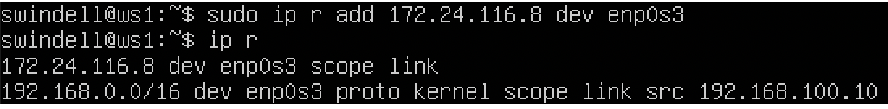
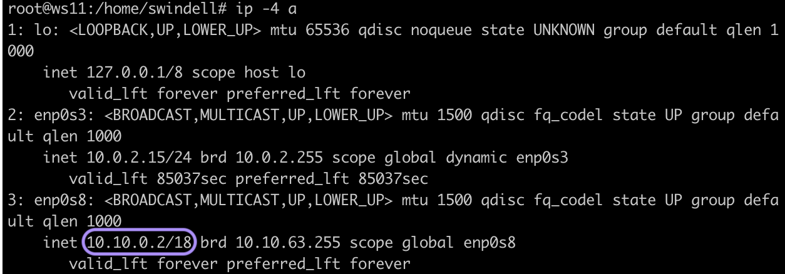
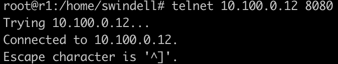

# Сети в Linux

## Part 1. Инструмент **ipcalc**
Командой `sudo apt install ipcalc` устанавливаем *ipcalc*
#### 1.1. Сети и маски
1. Определим адрес сети 192.167.38.54/13 с помощью команды `ipcalc
 192.167.38.54/13` \
    

2. Выполним перевод масок 255.255.255.0 в префиксную и двоичную запись, /15 в обычную и двоичную, 11111111.11111111.11111111.11110000 в обычную и префиксную \
     \
     \
    

3. Определим минимальный и максимальный хост в сети 12.167.38.4 при масках: 
    - /8\
        
    - 11111111.11111111.00000000.00000000\
        
    - 255.255.254.0\
        
    - /4\
        

#### 1.2. localhost
Определим, можно ли обратиться к приложению, работающему на localhost, со следующими IP: \
- 194.34.23.100: нет\

- 127.0.0.2: да\

- 127.1.0.1: да\

- 128.0.0.1: нет\

Для localhost зарезервирован диапазон IP-адресов 127.0.0.1 - 127.255.255.254. 

#### 1.3. Диапазоны и сегменты сетей
1. Определим, какие из перечисленных IP можно использовать в качестве публичного, а какие только в качестве частных:
    - 10.0.0.45 - частный
    - 134.43.0.2 - публичный
    - 192.168.4.2 - частный
    - 172.20.250.4 - частный
    - 172.0.2.1 - публичный
    - 192.172.0.1 - публичный
    - 172.68.0.2 - публичный
    - 172.16.255.255 - частный
    - 10.10.10.10 - частный
    - 192.169.168.1 - публичный

    Внутренние (частные, локальные, "серые") IP-адреса не используются в сети интернет. К внутренним относятся адреса, используемые в локальных сетях. Доступ к внутреннему IP-адресу можно получить лишь в пределах локальной подсети. \
К частным адресам относятся IP-адреса, значения которых лежат в следующих диапазонах: 10.0.0.0 – 10.255.255.255, 172.16.0.0 – 172.31.255.255, 192.168.0.0 – 192.168.255.255. \
Внешние (публичные, глобальные, "белые") IP-адреса используются в сети интернет. Публичным IP-адресом называется IP-адрес, под которым вас видят устройства в интернете, и он является уникальным во всей сети интернет. Доступ к устройству с публичным IP-адресом можно получить из любой точки глобальной сети.

2. Определим какие из перечисленных IP адресов шлюза возможны у сети 10.10.0.0/18: 10.0.0.1, 10.10.0.2, 10.10.10.10, 10.10.100.1, 10.10.1.255
    - Возможны: 10.10.0.2, 10.10.10.10, 10.10.1.255
    - Невозможны: 10.0.0.1, 10.10.100.1 
    <!-- (интерфейсы администрирования) -->

## Part 2. Статическая маршрутизация между двумя машинами
#### 2.0. Поднять две виртуальные машины
1. С помощью команды `ip a` посмотрим существующие сетевые интерфейсы у виртуальных машин ws1 и ws2 \
 \

2. Опишем сетевой интерфейс, соответствующий внутренней сети, на обеих машинах и зададим следующие адреса и маски: ws1 - 192.168.100.10, маска /16, ws2 - 172.24.116.8, маска /12. \
Для этого командой `sudo vim etc/netplan/00-installer-config.yaml` открываем и изменяем файлы на обеих машинах следующим образом \
 \

<!-- https://parallel.uran.ru/book/export/html/442 -->

3. Выполним команду `netplan apply` для перезапуска сервиса сети на обеих машинах \
 \
\
Теперь после изпользования команды `ip a` получаем следующий вывод для ws1 и ws2 \
 \

#### 2.1. Добавление статического маршрута вручную
1. Добавим статический маршрут от одной машины до другой и обратно при помощи команды вида `ip r add`\
<!-- https://winitpro.ru/index.php/2020/04/13/nastrojka-marshrutov-v-linux/ -->
 \

2. Пропингуем соединение между машинами
<!-- https://losst.pro/komanda-ping-v-linux -->
 \

#### 2.2. Добавление статического маршрута с сохранением
1. Перезапустим машины, а затем добавим статический маршрут от одной машины до другой с помощью файла *etc/netplan/00-installer-config.yaml* 
<!-- https://www.dmosk.ru/miniinstruktions.php?mini=network-netplan -->
<!-- https://habr.com/ru/post/448400/ -->

 \
 \
Командой `netplan apply` применяем изменения

2. Пропингуем соединение между машинами \
 \

## Part 3. Утилита **iperf3**
#### 3.1. Скорость соединения
- 8 Mbps = 1 MB/s
- 100 MB/s = 819200 Kbps
- 1 Gbps = 1024 Mbps

#### 3.2. Утилита iperf3
Измерим скорость соединения между ws1 и ws2. Для этого меняем в файле *etc/netplan/00-installer-config.yaml* строку *dhcp4: false* на *dhcp4: true*, чтобы скачать утилиту *iperf3*. Командой `sudo apt install iperf3` устанавливаем утилиту. Затем возвращаем обратно ранее установленную сеть.\
В качестве устройства-сервера выбираем ws1 и запускаем команду `iperf3 -s` \
 \
Затем на ws2 запускаем команду `iperf3 -c 192.168.100.10` и на обех машинах получаем идентичные результаты измерения скорости соединения\
 \

<!-- https://romantelychko.com/blog/1648/ -->

## Part 4. Сетевой экран
#### 4.1. Утилита iptables
<!-- https://losst.pro/nastrojka-iptables-dlya-chajnikov -->
<!-- https://timeweb.com/ru/community/articles/nastroyka-iptables-dlya-chaynikov -->
<!-- https://ru.wikibooks.org/wiki/Iptables -->
<!-- https://web.mit.edu/rhel-doc/4/RH-DOCS/rhel-rg-en-4/s1-iptables-options.html -->
1. Создадим файл /etc/firewall.sh для обеих машин со следующими правилами:
    - на ws1 применить стратегию когда в начале пишется запрещающее правило, а в конце пишется разрешающее правило (это касается пунктов 4 и 5)
    - на ws2 применить стратегию когда в начале пишется разрешающее правило, а в конце пишется запрещающее правило (это касается пунктов 4 и 5)
    - открыть на машинах доступ для порта 22 (ssh) и порта 80 (http)
    - запретить echo reply (машина не должна "пинговаться”, т.е. должна быть блокировка на OUTPUT)
    - разрешить echo reply (машина должна "пинговаться")

    /etc/firewall.sh для ws1 \
 \
/etc/firewall.sh для ws2 \

2. Запускаем файлы на обеих машинах командами `chmod +x /etc/firewall.sh` и `/etc/firewall.sh` \
ws1 \
 \
ws2 \
 \
Ключ -j отдаёт приоритет правилу, что находится в списке выше. Поэтому в 2 случае ping разрешен, а во 1 - нет.

#### 4.2. Утилита nmap
Командой `ping` находим машину, которая не "пингуется". \
ws1 \
 \
ws2 \
 

После чего утилитой *nmap* показываем, что хост машины запущен. \
 

## Part 5. Статическая маршрутизация сети
#### 5.1. Настройка адресов машин
1. Командой `sudo vim etc/netplan/00-installer-config.yaml` настраиваем файл для каждой машины:
    - ws11 \

    - ws21 \

    - ws22 \

    - r1 \

    - r2 \

    Командой `netplan apply` применяем изменения
2. Для всех машин выполним `ip -4 a`
    - ws11 \

    - ws21 \

    - ws22 \

    - r1 \

    - r2 \

    Пропингуем ws22 с ws21 и r1 с ws11
    - ws22 с ws21 \

    - r1 с ws11 \

#### 5.2. Включение переадресации IP-адресов.
1. Для включения переадресации IP, выполним команду `sysctl -w net.ipv4.ip_forward=1` на роутерах
    - r1 \

    - r2 \

    При таком подходе переадресация не будет работать после перезагрузки системы.

2. Откроем файл */etc/sysctl.conf* и добавим в него следующую строку `net.ipv4.ip_forward = 1`
    - r1 \

    - r2 \

    При использовании этого подхода, IP-переадресация включена на постоянной основе.

#### 5.3. Установка маршрута по-умолчанию
1. Настроиь маршрут по-умолчанию (шлюз) для машин. Для этого добавить default перед IP роутера в файле конфигураций *etc/netplan/00-installer-config.yaml*. Затем выполним команду `ip r` и покажем, что добавился маршрут в таблицу маршрутизации
    - Файл для ws11 \
 \
    `ip r` для ws11 \

    - Файл для ws21 \
 \
    `ip r` для ws21 \

    - Файл для ws22 \
 \
    `ip r` для ws22 \

2. Пропинговуем с ws11 роутером r2 и покажем на r2, что пинг доходит, используя команду: `tcpdump -tn -i eth1` \
 \

#### 5.4. Добавление статических маршрутов
1. Добавим в роутеры r1 и r2 статические маршруты в файле конфигураций
    - r1 \

    - r2 \

2. Выполним `ip r`, чтобы показать таблицы с маршрутами на обоих роутерах
    - r1 \

    - r2 \

3. Запустим `ip r list 10.10.0.0/18` и `ip r list 0.0.0.0/0` на ws1
    - `ip r list 10.10.0.0/18` \

    - `ip r list 0.0.0.0/0` \

    *Для адреса 10.10.0.0/18 был выбран не маршрут 0.0.0.0/0, потому что на 0.0.0.0/0 пакет отправляется только тогда, когда другой маршрут не задан явным образом в таблице маршрутизации хоста.*

Статический маршрут по умолчанию — это маршрут, которому соответствуют все пакеты. Вместо хранения всех маршрутов ко всем сетям в таблице маршрутизации маршрутизатор может хранить один маршрут по умолчанию, представляющий любую сеть, отсутствующую в таблице маршрутизации.

Маршрутизаторы обычно используют маршруты по умолчанию, настроенные локально или полученные от другого маршрутизатора, с помощью протокола динамической маршрутизации. Маршрут по умолчанию используется, если ни один из маршрутов в таблице маршрутизации не совпадает с IP-адресом места назначения пакета. Иными словами, при отсутствии более точных совпадений в качестве «шлюза последней надежды» используется маршрут по умолчанию.

#### 5.5. Построение списка маршрутизаторов
<!-- https://highload.today/traceroute-tracert/ -->
<!-- https://neoserver.ru/help/network-monitoring-linux-ping-traceroute-mtr -->
- Запустим *traceroute* на ws11 (traceroute 10.20.0.10) \

- Выполним `tcpdump -tnv -i enp0s8` на r1 \

Утилита traceroute отправляет серию пакетов данных целевому узлу и каждый раз увеличивает значение поля TTL на 1. Первый пакет отправляется с TTL = 1, traceroute фиксирует адрес маршрутизатора, а также время между отправкой пакета и получением ответа. Они выводят на экран. Затем traceroute повторяет отправку пакета, но уже с TTL, равным 2, что позволяет первому маршрутизатору пропустить пакет дальше. Процесс повторяется до тех пор, пока при определённом значении TTL пакет не достигнет целевого узла.

#### 5.6. Использование протокола **ICMP** при маршрутизации
- Пропингуем с ws11 несуществующий IP (например, 10.30.0.111) с помощью команды `ping -c 1 10.30.0.111` \

- Запустим на r1 перехват сетевого трафика, проходящего через enp0s8 с помощью команды `tcpdump -n -i enp0s8 icmp`

## Part 6. Динамическая настройка IP с помощью **DHCP**
DHCP (англ. Dynamic Host Configuration Protocol — протокол динамической настройки узла) — прикладной протокол, позволяющий сетевым устройствам автоматически получать IP-адрес и другие параметры, необходимые для работы в сети TCP/IP.
<!-- https://www.opennet.ru/base/net/dhcp_setup.txt.html -->

1. Для r2 настроим в файле /etc/dhcp/dhcpd.conf конфигурацию службы DHCP:
    - Укажем адрес маршрутизатора по-умолчанию, DNS-сервер и адрес внутренней сети. Перед этим командой `apt install isc-dhcp-server` устанавливаем соответствующую утилиту. Далее меняем файл \
    
    - В файле resolv.conf пропишем nameserver 8.8.8.8 \
    

2. Перезагрузим службу DHCP командой `systemctl restart isc-dhcp-server` \

    После перезагрузки ws21 через `ip a` покажем, что она получила адрес \

    Пропингуем ws21 c ws22 \

3. Укажем MAC адрес у ws11, для этого в etc/netplan/00-installer-config.yaml надо добавить строки: macaddress: 10:10:10:10:10:BA, dhcp4: true

4. Настроим r1 аналогично r2, но сделаем выдачу адресов с жесткой привязкой к MAC-адресу (ws11) \
    - */etc/dhcp/dhcpd.conf* на r1

    - */etc/resolv.conf* на r1

    - `systemctl restart isc-dhcp-server` на r1 \

    - `ip a` на ws11 \

5. Запросить с ws21 обновление ip адреса. Для обновления используем `dhclient -r enp0s8` для освобождения текущего адреса интерфейса *enp0s8*. Далее применяется `dhclient enp0s8` для задания нового адреса интерфейса *enp0s8*
    - `ip a` на ws21 до обновления \

    - `ip a` на ws21 после обносления \

## Part 7. **NAT**
NAT (Network Address Translation) – трансляция IP адресов, это механизм, позволяющий подменять адрес источника и назначения в заголовке IP пакетов, при их прохождении через маршрутизатор, т.е. между разными сетями.
<!-- Сети обычно проектируются с использованием частных IP адресов. Это адреса 10.0.0.0/8, 172.16.0.0/12 и 192.168.0.0/16. Эти частные адреса используются внутри организации или площадки, чтобы позволить устройствам общаться локально, и они не маршрутизируются в интернете. Чтобы позволить устройству с приватным IPv4-адресом обращаться к устройствам и ресурсам за пределами локальной сети, приватный адрес сначала должен быть переведен на общедоступный публичный адрес. -->

SNAT(Static) - один внутренний адрес преобразуется в один внешний, все запросы, приходящие на внешний адрес будут транслироваться на внутренний, как будто хост и является обладателем белого IP-адреса.

DNAT(Dynamic) - Ситуация похожа на статический NAT — один приватный адрес транслируется на один внешний, — но теперь внешний не чётко зафиксирован, а будет выбираться динамически из заданного диапазона.
<!-- Для файервола: -->
<!-- https://winitpro.ru/index.php/2019/08/13/nastrojka-internet-shlyuza-s-nat-i-port-forward-linux/ -->

1. В файле /etc/apache2/ports.conf на ws22 и r1 изменим строку *Listen 80* на *Listen 0.0.0.0:80*, то есть сделаем сервер Apache2 общедоступным
    - */etc/apache2/ports.conf* на ws22 \

    - */etc/apache2/ports.conf* на r1 \

2. Запустим веб-сервер *Apache* командой `service apache2 start` на ws22 и r1
    - `service apache2 start` на ws22 \

    - `service apache2 start` на r1 \

3. Добавим в фаервол, созданный по аналогии с фаерволом из Части 4, на r2 следующие правила: 
    - **Удаление правил в таблице filter - `iptables -F`**
    - **Удаление правил в таблице "NAT" - `iptables -F -t nat`**
    - **Отбрасывать все маршрутизируемые пакеты - `iptables --policy FORWARD DROP`**

    

4. Запустим файл также, как в Части 4 (командами `chmod +x /etc/firewall.sh` и `/etc/firewall.sh`) \

5. Проверим соединение между ws22 и r1 командой `ping` \
 \
При запуске файла с этими правилами, ws22 не должна "пинговаться" с r1

6. Добавим в файл ещё одно правило:
    - **Разрешить маршрутизацию всех пакетов протокола ICMP**

    

7. Запустим файл также, как в Части 4 (командами `chmod +x /etc/firewall.sh` и `/etc/firewall.sh`) \

8. Проверим соединение между ws22 и r1 командой `ping` \
 \
При запуске файла с этими правилами, ws22 должна "пинговаться" с r1

9. Добавим в файл ещё два правила:
    - **Включить SNAT, а именно маскирование всех локальных ip из локальной сети, находящейся за r2** (по обозначениям из Части 5 - сеть 10.20.0.0)
    - **Включить DNAT на 8080 порт машины r2 и добавить к веб-серверу Apache, запущенному на ws22, доступ извне сети**

    

10. Запустим файл также, как в Части 4 (командами `chmod +x /etc/firewall.sh` и `/etc/firewall.sh`) \

11. Проверим соединение по TCP для SNAT, для этого с ws22 подключимся к серверу Apache на r1 командой: `telnet [адрес] [порт]` \

12. Проверим соединение по TCP для DNAT, для этого с r1 подключимся к серверу Apache на ws22 командой `telnet` (обращаться по адресу r2 и порту 8080) \

## Part 8. Дополнительно. Знакомство с **SSH Tunnels**
1. Запустим на r2 фаервол с правилами из Части 7

2. Запустим веб-сервер Apache на ws22 только на localhost (то есть в файле /etc/apache2/ports.conf изменить строку Listen 80 на Listen localhost:80) \
 \
Запустим веб-сервер *Apache* командой `service apache2 start` на ws22 и проверим командой `service apache2 status` \

3. Воспользуемся Local TCP forwarding с ws21 до ws22, чтобы получить доступ к веб-серверу на ws22 с ws21 (командой `ssh -L 8080:localhost:80 swindell@10.20.0.20`) \

4. Воспользуемся Remote TCP forwarding c ws11 до ws22, чтобы получить доступ к веб-серверу на ws22 с ws11 (командой `ssh -R 8080:localhost:80 swindell@10.20.0.20`) \

5. Для проверки, сработало ли подключение в обоих предыдущих пунктах, перейдем во второй терминал (например, клавишами Alt + F2) и выполним команду: `telnet 127.0.0.1 [локальный порт]`
    - ws21 \
    
    - ws11 \
    

